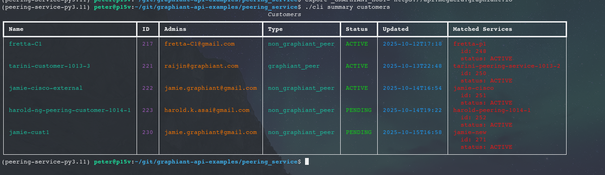
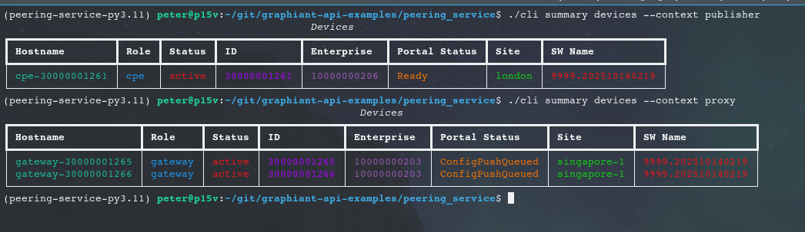
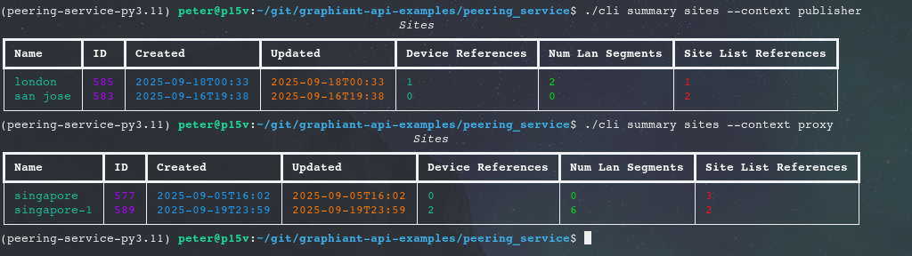
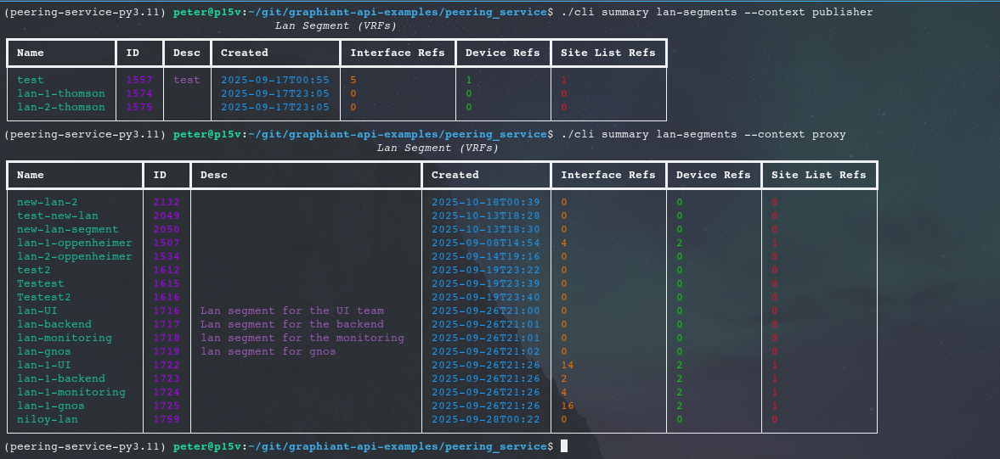
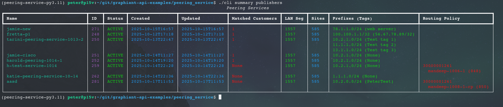

# Peering Services CLI.

This application demonstrates how to work with peering services via the Graphiant
Python SDK. At present it is mostly limited to viewing peering services state,
though incremental additions to all more service creation logic will be added over
the coming weeks.

## Install.

Install poetry is not already:

```
sudo apt-get install python3-poetry
```

Install python dependencies, this will also create a virtual environment for you to
use:

```
cd peering_service
poetry install
```

Set in to the virtual environment that poetry created:

```
. ~/.cache/pypoetry/virtualenvs/peering-service-dJHHNBfM-py3.11/bin/activate
```

## Running.

A few environment variables are required in order to run the cli tool:

  * GRAPHIANT_PUBLISHER_USERNAME - The username associated with the service producer account.
  * GRAPHIANT_PUBLISHER_PASSWORD - The password associated with the service producer account.
  * GRAPHIANT_PROXY_USERNAME - The username associated with the proxy tenant account.
  * GRAPHIANT_PROXY_PASSWORD - The password associated with the proxy tenant account.

With those set we can run the tool:

```
(peering-service-py3.11) peter@p15v:~/git/graphiant-api-examples/peering_service$ ./cli --help
Usage: cli [OPTIONS] COMMAND [ARGS]...

  A sample application which uses the Graphiant API to introspect peering
  services.

Options:
  --help  Show this message and exit.

Commands:
  create   Commands for creating service related items.
  summary  Commands for displaying service related items.
(peering-service-py3.11) peter@p15v:~/git/graphiant-api-examples/peering_service$
```

Most commands take a --context argument which allows you to specify if the command should be
run in the context of the service publisher or service proxy tenant.

## Create Service.

There is limited support for creating service components via this tool at present, currently
I've only implemented support for creating the publisher construct minus any routing policy.

```
(peering-service-py3.11) peter@p15v:~/git/graphiant-api-examples/peering_service$ ./cli create publisher "my-service" "my service description" test --site london --prefix-and-tag "10.1.2.0/24,Tag" --prefix-and-tag "10.1.3.0/24"
```

Each --prefix-and-tag option takes the form:

Prefix,OptionalTag

For example:

"10.0.2.0/24,My Tag"

or

"10.0.2.0/24"

are both valid.

## Example output.

### Summary Services


### Summary Customers



### Summary Devices



### Summary Sites



### Summary Lan Segments



### Summary Publishers



## TODO.

  * Full e2e service creation. Currently only the publisher create stage is implemented
    via "create publisher".
